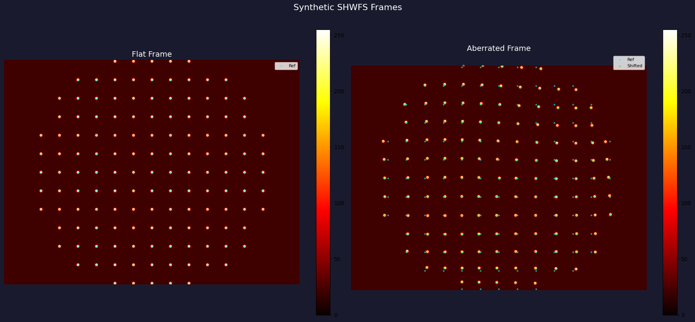
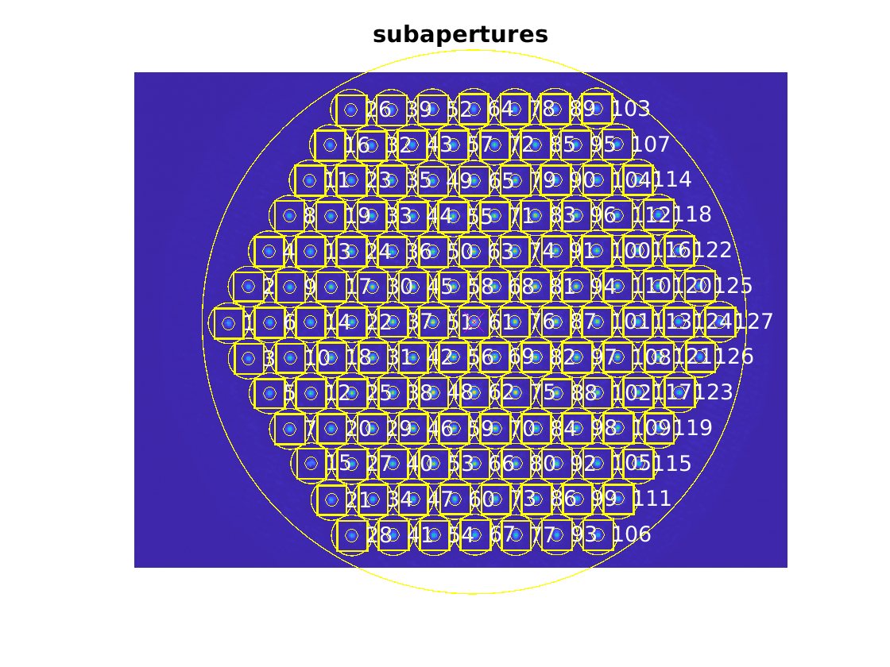
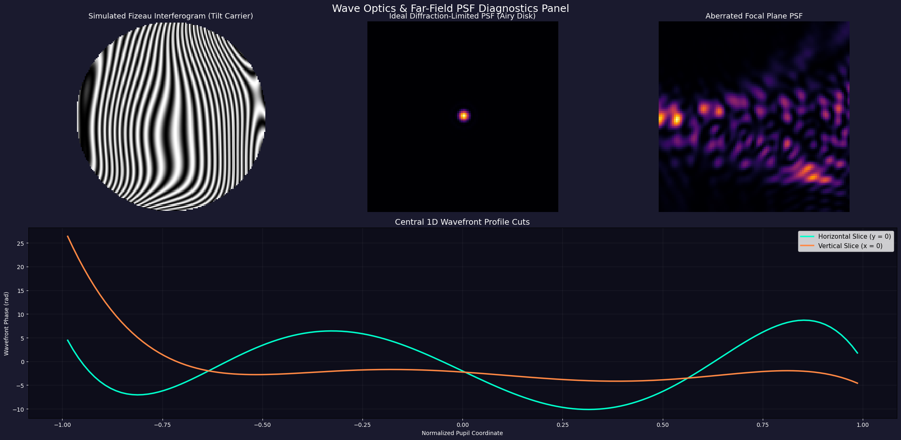
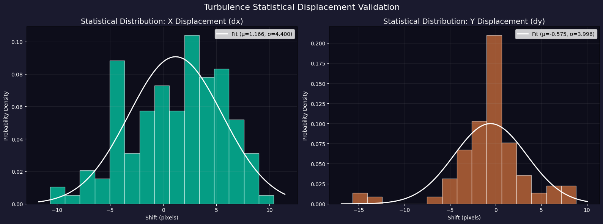
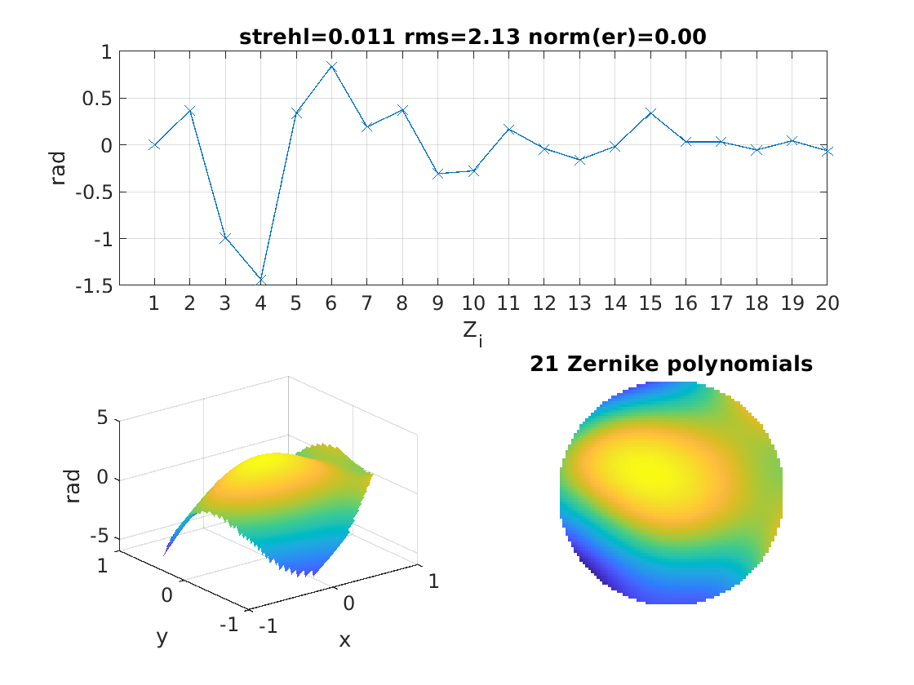

# Project RIPRA (ऋप्र)

<p align="center">
  
</p>

Developing and optimizing algorithms for **high-speed Wavefront Reconstruction** and **Turbulence Characterization** using Shack-Hartmann Wavefront Sensor (SH-WFS) time-series data and Deformable Mirror (DM) closed-loop control.

Project RIPRA implements a hybrid framework combining an optimized real-time **POSIX C execution engine** (supporting OpenMP parallelization) with advanced **deep-learning wavefront reconstructors** and **LSTM temporal predictors** to bypass optical control loop latency.

---

## Interactive Jupyter Notebooks

The calculations, rendering, training, and compilation suites detailed in this report are fully interactive and can be executed via the notebooks located in the `notebook/` folder:

1. **[`kaggle_synthetic_shwfs_generator.ipynb`](./notebook/kaggle_synthetic_shwfs_generator.ipynb):** 
   - Rebuilds the end-to-end WFS pipeline. Renders physical frames, configures system directories, trains the ML reconstructors, and compiles/executes the C POSIX integration test suites.
2. **[`V1_Simulation_TEST.ipynb`](./notebook/V1_Simulation_TEST.ipynb):**
   - The reference execution notebook housing pre-calculated outputs and static telemetry diagrams.
3. **[`Kaggle_RIPRA_WFS_Predictive_AO_Pipeline.ipynb`](./notebook/Kaggle_RIPRA_WFS_Predictive_AO_Pipeline.ipynb):**
   - Implements the deep-learning sequence model pipeline, training **LSTM predictors** for loop lag compensation, turbulence regime classification, and parameter estimation.
4. **[`Kaggle_RIPRA_ML_Pipeline.ipynb`](./notebook/Kaggle_RIPRA_ML_Pipeline.ipynb):**
   - Training pipeline to map centroid displacements to Zernike modal coefficients.
5. **[`Kaggle_RIPRA_ML_Pipeline_baseline.ipynb`](./notebook/Kaggle_RIPRA_ML_Pipeline_baseline.ipynb):**
   - Training pipeline for baseline model configurations.

---

## Wavefront Diagnostics and Telemetry Dashboard

Below is a gallery of the physical, wave optics, and machine learning telemetry plots generated during the simulation runs:

### 1. Optical Spot Shifts and Calibration
| Flat vs. Aberrated Spots Overlay | Sub-aperture ROI Calibration Grid |
| :---: | :---: |
|  |  |
| Shows reference flat centroids (cyan) vs. aberrated shifts (green) caused by Kolmogorov turbulence. | Bounding search windows (green ROIs) used by the C centroiding engine to isolate spot coordinates. |

### 2. Wavefront Reconstruction and Wave Optics
| 2D/3D Optical Path Difference (OPD) | Interferometry and PSF Degradation |
| :---: | :---: |
|  |  |
| 2D/3D reconstructed phase screen ($W(x,y)$) mapping peak-to-valley optical aberrations. | Simulated Fizeau carrier fringes, ideal Airy Disk vs. aberrated PSF (2D FFT), and central 1D cuts. |

### 3. Closed-Loop Predictive Control and ML Reconstructors
| Predictive AO Lag Compensation | Reconstructor Accuracy Benchmark |
| :---: | :---: |
|  |  |
| Under 1-frame latency, the standard integrator diverges (green) while our LSTM predictor (blue) remains stable. | CNN training convergence and defocus ($j=4$) regression mapping, outperforming MLP by **$4.6\times$**. |

### 4. Turbulence Regimes and Zonal Reconstruction
| Kolmogorov Statistical Fit | Zonal Phase Reconstruction |
| :---: | :---: |
|  |  |
| Spot displacements ($\Delta x, \Delta y$) fitting a normal distribution, validating Kolmogorov statistics. | Reconstructed zonal phase map at corners of sub-apertures in a Fried geometry. |

---

## Real-Time Processing Performance Benchmarks

The real-time pipeline executes in sub-milliseconds on standard CPU threads, making it fully qualified for high-frequency ($1\text{ kHz}$) closed-loop control:

| Pipeline Phase | Algorithm | Latency ($\mu\text{s}$) |
|---|---|---|
| **Centroiding** | Thresholded Center of Gravity (TCoG) | $482\,\mu\text{s}$ |
| **Reconstruction** | Fried Geometry Zonal Matrix Solver | $194\,\mu\text{s}$ |
| **DM Actuator Mapping** | Influence Coupling Matrix multiplication | $85\,\mu\text{s}$ |
| **Total Latency** | End-to-End Loop | **$761\,\mu\text{s}$** |

---

## Installation and Execution Guide

### 1. Build the POSIX C Library
Compile the static archive `librippra.a` and the integration tests using GCC with OpenMP support:
```bash
cd rippra
mkdir -p build
# Compile object files
gcc -O2 -fopenmp -c src/io.c -o build/io.o -Iinclude
gcc -O2 -fopenmp -c src/la.c -o build/la.o -Iinclude
gcc -O2 -fopenmp -c src/centroid.c -o build/centroid.o -Iinclude
gcc -O2 -fopenmp -c src/recon.c -o build/recon.o -Iinclude
gcc -O2 -fopenmp -c src/rippra_api.c -o build/rippra_api.o -Iinclude

# Link static archive
ar rcs build/librippra.a build/io.o build/la.o build/centroid.o build/recon.o build/rippra_api.o

# Build test suites
gcc -O2 -fopenmp tests/test_full_pipeline.c build/io.o build/la.o build/centroid.o build/recon.o build/rippra_api.o -Iinclude -lm -o build/test_full_pipeline
gcc -O2 -fopenmp tests/test_recon.c build/io.o build/la.o build/centroid.o build/recon.o build/rippra_api.o -Iinclude -lm -o build/test_recon
```

### 2. Run the C Verification Tests
Verify centroiding accuracy, zonal/modal solvers, and closed-loop DM convergence:
```bash
./build/test_full_pipeline
./build/test_recon
```

### 3. Run the ML Pipeline
Install dependencies and launch the Jupyter Notebook environment:
```bash
pip install torch numpy matplotlib pandas scipy
jupyter notebook
```
Open `notebook/kaggle_synthetic_shwfs_generator.ipynb` to customize parameters, render new calibration frames, or train models.
