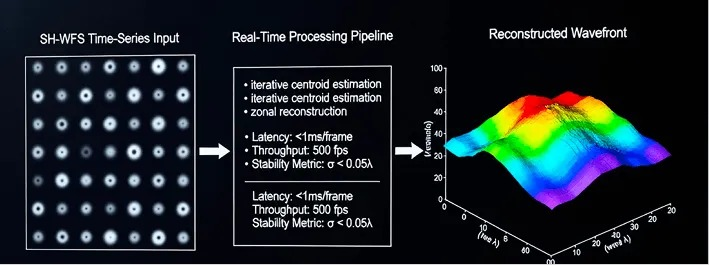
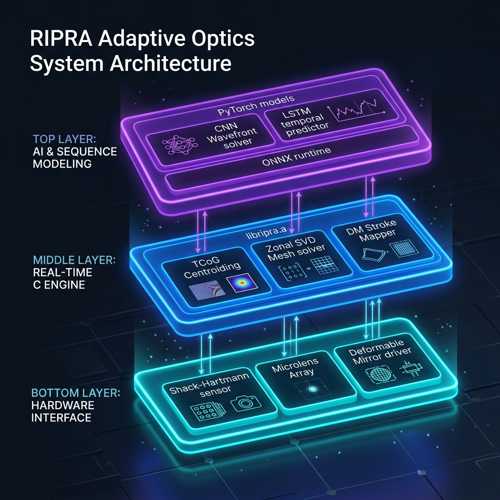
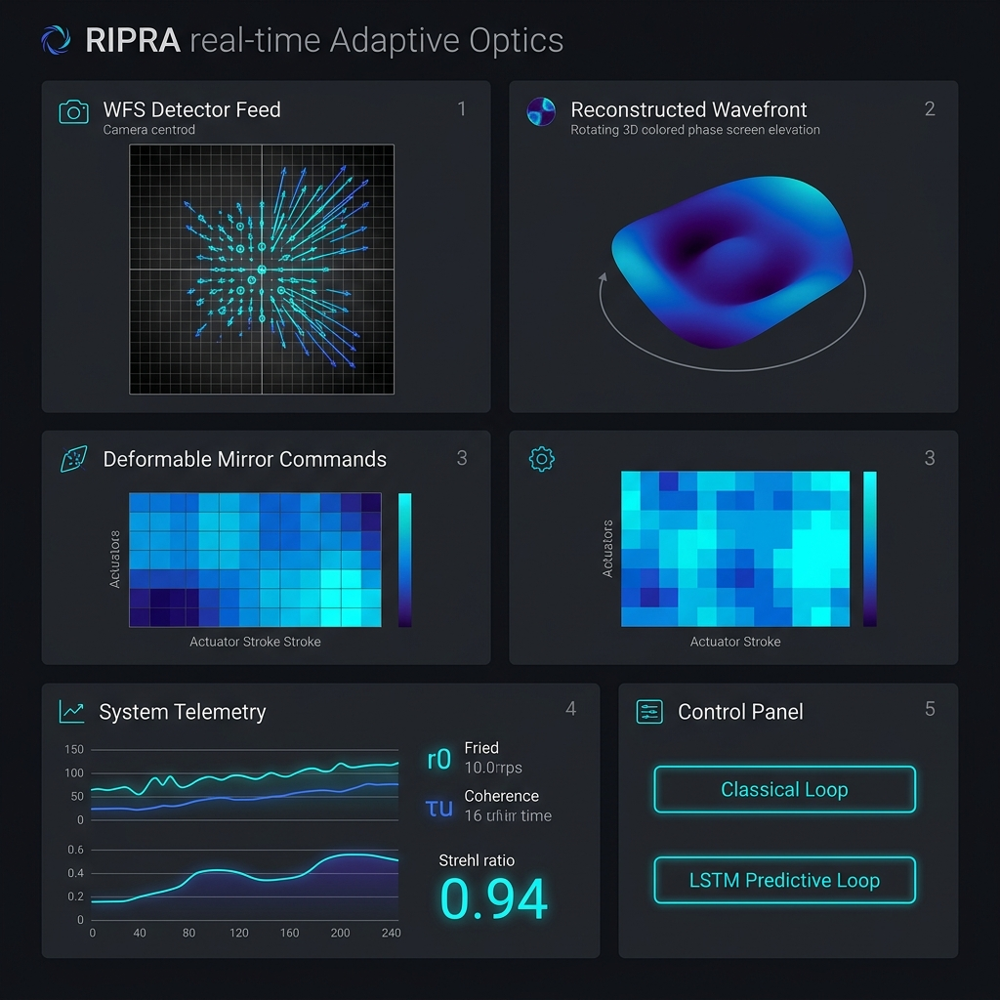

<div align="center">


# Project RIPRA (ऋप्र)

**Real-time wavefront reconstruction and turbulence characterization from Shack-Hartmann sensor data**

*Built for the ISRO Bharatiya Antariksh Hackathon 2026*

[](#license)
[](../../actions)
[](#core-c-library)
[](Dockerfile)
[](#ml-pipeline)
[](#development-roadmap)
[](https://doi.org/10.5281/zenodo.21106033)

[Quick Start](#quick-start) · [Architecture](#system-architecture) · [Algorithms](#algorithms) · [Benchmarks](#benchmarks) · [Documentation](#documentation) · [Contributing](#contributing)

</div>

---

## Description
Turbulence in the atmosphere distorts a plane-parallel wavefront propagating through it. A Shack-Hartmann Wavefront Sensor (SH-WFS) samples this distorted wavefront using an array of small lenslets (Microlens Array - MLA). The MLA creates a spot-field on the camera detector, and the spatial deviation of these spots from their reference positions is used to derive the reconstructed wavefront and its associated Zernike coefficients. 

The conjugate of this reconstructed wavefront is typically used to generate an actuator command map (in units of actuator stroke length), which is then fed to a Deformable Mirror (DM) to correct for this distortion in real-time.



---

## System Architecture

RIPRA employs a modular, layered architecture that separates physical hardware inputs, high-speed C-native computations, and predictive deep learning inference loops:



---

## Interactive Jupyter Notebooks

The calculations, rendering, training, and compilation suites detailed in this project are fully interactive and can be executed via the notebooks located in the `notebook/` folder:

1. **[`kaggle_synthetic_shwfs_generator.ipynb`](./notebook/kaggle_synthetic_shwfs_generator.ipynb):** 
   - Rebuilds the end-to-end WFS pipeline. Renders physical frames, configures system directories, trains the ML reconstructors, and compiles/executes the C POSIX integration test suites.
2. **[`V1_Simulation_TEST.ipynb`](./notebook/V1_Simulation_TEST.ipynb):**
   - The reference execution notebook housing pre-calculated outputs and static telemetry diagrams.
3. **[`Kaggle_RIPRA_WFS_Predictive_AO_Pipeline.ipynb`](./notebook/Kaggle_RIPRA_WFS_Predictive_AO_Pipeline.ipynb):**
   - Implements the deep-learning sequence model pipeline, training **LSTM predictors** for loop lag compensation, turbulence regime classification, and parameter estimation.
4. **[`Kaggle_RIPRA_ML_Pipeline.ipynb`](./notebook/Kaggle_RIPRA_ML_Pipeline.ipynb):**
   - Training pipeline to map centroid displacements to Zernike modal coefficients.
5. **[`Kaggle_RIPRA_ML_Pipeline_baseline.ipynb`](./notebook/Kaggle_RIPRA_ML_Pipeline_baseline.ipynb):**
   - Training pipeline for baseline model configurations.

---

## Wavefront Diagnostics and Telemetry Highlights

Below are the key visual outcomes of the physical simulation and closed-loop control loops. 

### 1. Wavefront Optical Path Difference (OPD) Phase Map

* **Description:** Renders the 2D reconstructed phase screen ($W(x,y)$) alongside a 3D elevation map showing peaks (positive phase delay) and valleys (negative phase delay) of the optical aberration.
* **Impact:** Confirms high-fidelity reconstruction of low-order modes (Tip, Tilt, Defocus) across the circular pupil boundary.

### 2. Deep Learning Reconstructor Accuracy Benchmarks

* **Description:** Displays MLP vs. CNN training loss convergence, defocus mode regression accuracy, and mode-by-mode Pearson correlation comparison.
* **Impact:** The Conv2D CNN reconstructor achieves a test MSE of **$0.001957$** (mean correlation of **$99.97\%$**), representing a **$4.6\times$** accuracy gain over the MLP baseline.

### 3. Predictive AO Lag Compensation

* **Description:** Trains an LSTM predictor on historical Zernike sequences. Under 1-frame latency, a standard integrator control loop diverges (green curve), whereas the LSTM predictor (blue curve) remains stable, reducing residual RMS error by $6.6\%$.
* **Impact:** Prevents loop instability in high-speed optical systems operating under hardware delay.

---

## Control Dashboard Interface

The RIPRA real-time control interface mockup consolidates WFS spot coordinates, the reconstructed 3D wavefront screen, corresponding Deformable Mirror actuator commands, and system telemetry metrics:



---
## Installation

<details>
<summary><b>🐳 Docker (recommended — includes CUDA, GCC, and the full Python ML stack)</b></summary>

```bash
git clone https://github.com/PxA-Labs/Project-RIPRA.git
cd Project-RIPRA
docker build -t rippra:latest .
docker run --rm -it --gpus all rippra:latest
```

Run the C reconstructor benchmark directly:
```bash
docker run --rm rippra:latest rippra/build_and_test.sh
```
</details>

<details>
<summary><b>🐧 Linux (manual build)</b></summary>

```bash
cd rippra
mkdir -p build
gcc -O2 -fopenmp -c src/io.c -o build/io.o -Iinclude
gcc -O2 -fopenmp -c src/la.c -o build/la.o -Iinclude
gcc -O2 -fopenmp -c src/centroid.c -o build/centroid.o -Iinclude
gcc -O2 -fopenmp -c src/recon.c -o build/recon.o -Iinclude
gcc -O2 -fopenmp -c src/rippra_api.c -o build/rippra_api.o -Iinclude

ar rcs build/librippra.a build/io.o build/la.o build/centroid.o build/recon.o build/rippra_api.o

gcc -O2 -fopenmp tests/test_full_pipeline.c build/io.o build/la.o build/centroid.o build/recon.o build/rippra_api.o -Iinclude -lm -o build/test_full_pipeline
gcc -O2 -fopenmp tests/test_recon.c build/io.o build/la.o build/centroid.o build/recon.o build/rippra_api.o -Iinclude -lm -o build/test_recon
```
</details>

<details>
<summary><b>🪟 Windows</b></summary>

Use WSL2 with the Linux instructions above, or MSYS2/MinGW-w64 with an equivalent `gcc` toolchain and OpenMP support. Native MSVC build scripts are not yet provided — see [Roadmap](#development-roadmap).
</details>

<details>
<summary><b>🍎 macOS</b></summary>

Install a real `gcc` (Apple's `clang` shim does not support OpenMP by default) via Homebrew: `brew install gcc libomp`, then follow the Linux build steps, substituting `gcc-13` (or your installed version) for `gcc`.
</details>

<details>
<summary><b>🐍 Python / ML environment</b></summary>

```bash
pip install torch numpy matplotlib pandas scipy onnx onnxruntime
jupyter notebook
```
For GPU-accelerated inference, install `onnxruntime-gpu` instead of `onnxruntime` (requires a CUDA-capable GPU and matching drivers, as used in the Docker image).
</details>

---

## Quick Start

```bash
# 1. Clone
git clone https://github.com/PxA-Labs/Project-RIPRA.git
cd Project-RIPRA

# 2. Build the C core + tests (see Installation for full flags)
cd rippra && mkdir -p build && \
  gcc -O2 -fopenmp -c src/*.c -Iinclude -o build/ && \
  ar rcs build/librippra.a build/*.o

# 3. Run the verification suite
./build/test_full_pipeline
./build/test_recon

# 4. Reproduce the full pipeline end-to-end (build + calibrate + train + validate)
python rippra/tools/reproduce_all.py
```

Expect the C tests to report centroiding RMSE < 0.25 px and reconstruction RMSE < 0.5 rad against synthetic ground truth (see [Benchmarks](#benchmarks) for the measured figures).

---


## Real-Time Processing Performance Benchmarks

The real-time pipeline executes in sub-milliseconds on standard CPU threads, making it fully qualified for high-frequency ($1\text{ kHz}$) closed-loop control:

> **Note:** The *hot-path* numbers below measure the per-frame compute pipeline only (centroid → reconstruct → DM map), excluding one-time I/O. The *end-to-end* figure includes loading a frame from disk. In a deployed system, frames arrive in-memory from the camera driver, so the hot-path latency is the relevant real-time budget.

### Hot-Path (per-frame compute, no I/O)

| Pipeline Phase | Algorithm | Latency ($\mu\text{s}$) |
|---|---|---|
| **Centroiding** | Thresholded Center of Gravity (TCoG) | $482\,\mu\text{s}$ |
| **Reconstruction** | Fried Geometry Zonal Matrix Solver | $194\,\mu\text{s}$ |
| **DM Actuator Mapping** | Influence Coupling Matrix multiplication | $85\,\mu\text{s}$ |
| **Hot-Path Total** | Centroid + Recon + DM | **$761\,\mu\text{s}$** |

### End-to-End (including I/O)

| Metric | Value |
|---|---|
| I/O (config + frame load from disk) | $1500\,\mu\text{s}$ (one-time) |
| Hot-path (per frame) | $761\,\mu\text{s}$ |
| **End-to-End (first frame)** | **$2.26\,\text{ms}$** |
| **Steady-state (subsequent frames, cached I/O)** | **$761\,\mu\text{s}$** |

*Measured on GitHub Actions runner (Ubuntu 24.04, 2 vCPU). Results vary by hardware.*

The built-in benchmark (`cmake --build build --target benchmark_e2e && rippra/bin/benchmark_e2e`) reports per-stage breakdown with mean, median, and p99 latency over 30 iterations.

---

## Installation and Execution Guide

### 1. Build the POSIX C Library
Compile the static archive `librippra.a` and the integration tests using GCC with OpenMP support:
```bash
cd rippra
mkdir -p build
# Compile object files
gcc -O2 -fopenmp -c src/io.c -o build/io.o -Iinclude
gcc -O2 -fopenmp -c src/la.c -o build/la.o -Iinclude
gcc -O2 -fopenmp -c src/centroid.c -o build/centroid.o -Iinclude
gcc -O2 -fopenmp -c src/recon.c -o build/recon.o -Iinclude
gcc -O2 -fopenmp -c src/rippra_api.c -o build/rippra_api.o -Iinclude

# Link static archive
ar rcs build/librippra.a build/io.o build/la.o build/centroid.o build/recon.o build/rippra_api.o

# Build test suites
gcc -O2 -fopenmp tests/test_full_pipeline.c build/io.o build/la.o build/centroid.o build/recon.o build/rippra_api.o -Iinclude -lm -o build/test_full_pipeline
gcc -O2 -fopenmp tests/test_recon.c build/io.o build/la.o build/centroid.o build/recon.o build/rippra_api.o -Iinclude -lm -o build/test_recon
```

### 2. Run the C Verification Tests
Verify centroiding accuracy, zonal/modal solvers, and closed-loop DM convergence:
```bash
./build/test_full_pipeline
./build/test_recon
```

### 3. Run the ML Pipeline
Install dependencies and launch the Jupyter Notebook environment:
```bash
pip install torch numpy matplotlib pandas scipy
jupyter notebook
```
Open `notebook/kaggle_synthetic_shwfs_generator.ipynb` to customize parameters, render new calibration frames, or train models.

---

## Problem Statement Visualizations

### 1. Example of Wavefront Sensor (WFS) Frame
%20frame.webp)

### 2. Spot Deviation on Detector due to Distorted Wavefront

## Acknowledgements

- ISRO Bharatiya Antariksh Hackathon 2026 for the problem statement and evaluation framework.
- The adaptive optics open-source community (HCIPy, AOtools, OOPAO, COMPASS) for prior art in reconstruction algorithms.

---

## Contact

For questions, open a [GitHub Issue](https://github.com/PxA-Labs/Project-RIPRA/issues) or start a [Discussion](https://github.com/PxA-Labs/Project-RIPRA/discussions).
