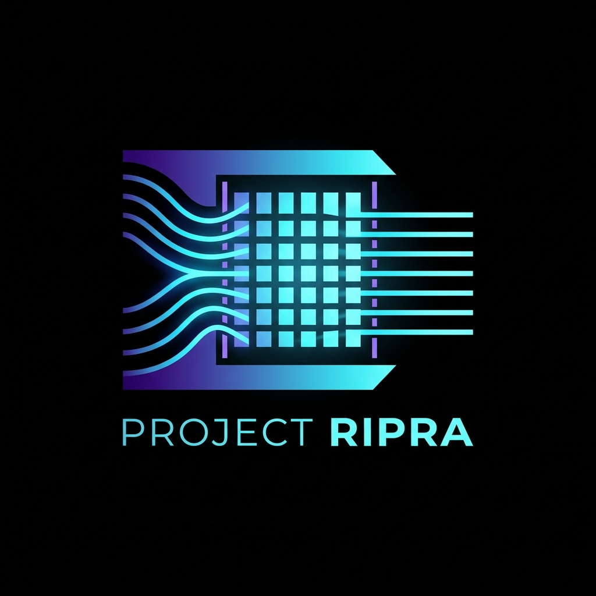
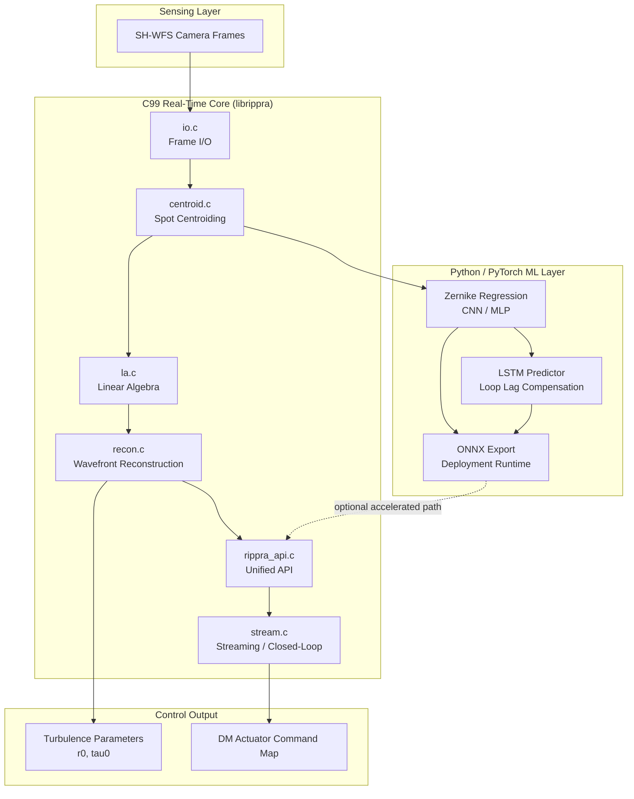
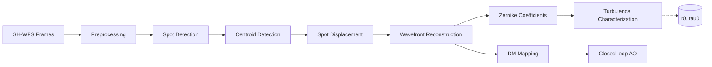
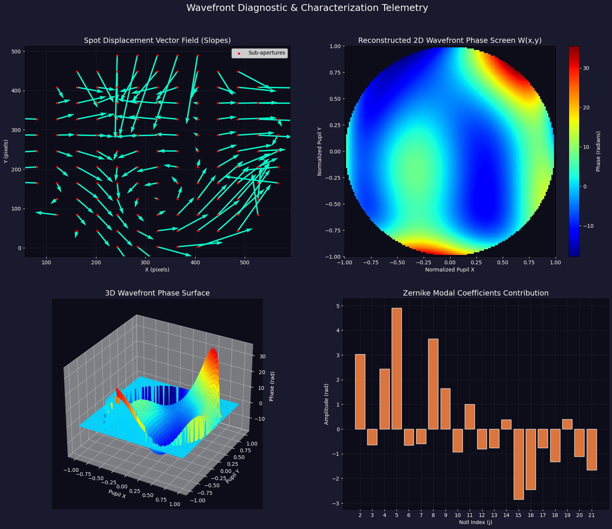
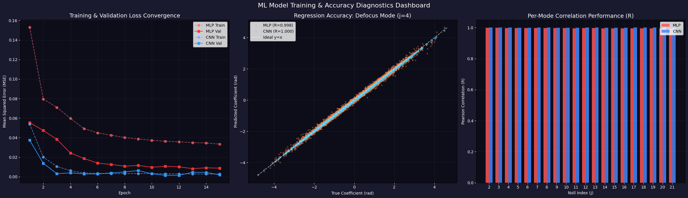
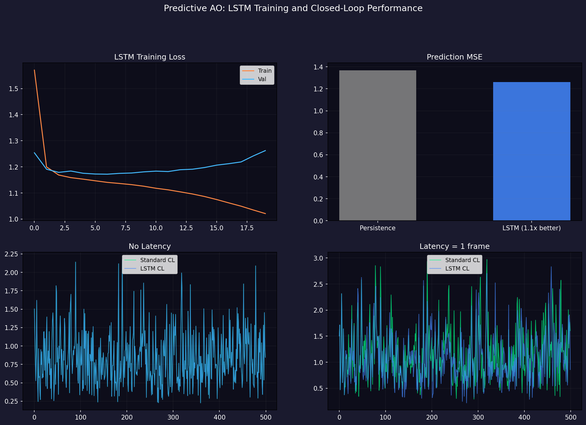

<div align="center">



# Project RIPRA (ऋप्र)

**Real-time wavefront reconstruction and turbulence characterization from Shack-Hartmann sensor data**

*Built for the ISRO Bharatiya Antariksh Hackathon 2026*

[](#license)
[](../../actions)
[](#core-c-library)
[](Dockerfile)
[](#ml-pipeline)
[](#development-roadmap)
[](../../stargazers)

[Quick Start](#quick-start) · [Architecture](#system-architecture) · [Algorithms](#algorithms) · [Benchmarks](#benchmarks) · [Documentation](#documentation) · [Contributing](#contributing)

</div>

---

> **⚠️ Maintainer note:** This README describes the intended full scope of Project RIPRA. Before merging, confirm every checkbox in the [Repository Structure](#repository-structure) section against the actual `main` branch — some paths (`tools/reproduce_all.py`, `tests/test_full_pipeline.c`, `config/`) are asserted in project documentation but were not independently verified at time of writing. Replace the badge URLs with real ones once a CI workflow and LICENSE file exist.

## Table of Contents

- [Overview](#overview)
- [Features](#features)
- [System Architecture](#system-architecture)
- [Processing Pipeline](#processing-pipeline)
- [Algorithms](#algorithms)
- [Mathematics](#mathematics)
- [Repository Structure](#repository-structure)
- [Installation](#installation)
- [Quick Start](#quick-start)
- [Examples](#examples)
- [Visualizations](#visualizations)
- [Benchmarks](#benchmarks)
- [Dataset](#dataset)
- [Research](#research)
- [Documentation](#documentation)
- [Testing](#testing)
- [Development Roadmap](#development-roadmap)
- [Contributing](#contributing)
- [Citation](#citation)
- [License](#license)
- [Acknowledgements](#acknowledgements)
- [Contact](#contact)

---

## Overview

Atmospheric turbulence distorts an otherwise plane wavefront as it propagates to a telescope aperture. A **Shack-Hartmann Wavefront Sensor (SH-WFS)** samples this distorted wavefront with a microlens array (MLA): each lenslet focuses a sub-aperture of the beam onto a detector, and the displacement of each resulting spot from its calibrated reference position encodes the local wavefront slope. Project RIPRA reconstructs the full wavefront phase map from these spot displacements, characterizes the underlying turbulence statistically, and computes the actuator command map needed to drive a deformable mirror (DM) in a closed adaptive-optics (AO) loop.

**Why it exists:** atmospheric coherence times are on the order of milliseconds, so any correction system must detect and correct distortion in well under 10 ms. This project was built to answer that requirement — with a real-time C99 core for the numerically expensive path (centroiding, reconstruction, actuator mapping) and a Python/PyTorch layer for training and benchmarking learned reconstructors and predictive controllers.

**ISRO Bharatiya Antariksh Hackathon 2026 context:** RIPRA addresses the hackathon's wavefront sensing and reconstruction problem statement — process a laboratory-simulated time series of SH-WFS frames, recover per-frame wavefront phase maps and Zernike coefficients, derive turbulence parameters (Fried parameter $r_0$, coherence time $\tau_0$), and generate a DM actuator command map, all fast enough for real-time closed-loop correction.

---

## Features

| Capability | Description |
|---|---|
| 🔬 **SH-WFS frame processing** | Ingests time-series `.bmp` sensor frames, applies background subtraction and thresholding |
| 📍 **Spot centroiding** | Thresholded Center-of-Gravity (TCoG) centroid extraction per sub-aperture |
| 🌊 **Wavefront reconstruction** | Zonal (Fried geometry, Southwell, least-squares) and modal (Zernike) reconstructors |
| 🎯 **Zernike decomposition** | Projects reconstructed phase onto Zernike polynomial basis for modal analysis |
| 🌪️ **Turbulence characterization** | Statistical estimation of Fried parameter ($r_0$) and coherence time ($\tau_0$) from the frame sequence |
| 🪞 **DM actuator mapping** | Converts the conjugate wavefront into actuator stroke commands, including inter-actuator coupling compensation |
| 🔮 **Predictive AO** | LSTM-based predictor compensating for closed-loop latency |
| 🧠 **ML reconstruction benchmarks** | CNN/MLP reconstructors trained to map centroid displacement fields directly to Zernike coefficients |
| ⚡ **High-performance C core** | OpenMP-parallelized C99 implementation targeting sub-millisecond, kHz-rate loop execution |
| 📊 **Visualization tooling** | Phase-map rendering, ML diagnostic dashboards, and closed-loop telemetry plots |

---

## System Architecture



---

## Processing Pipeline



| Stage | Purpose | Implementation |
|---|---|---|
| Preprocessing | Background subtraction, thresholding | `rippra/src/io.c` |
| Spot Detection | Locate lenslet spot regions | `rippra/src/centroid.c` |
| Centroid Detection | Sub-pixel spot centroid via TCoG | `rippra/src/centroid.c` |
| Spot Displacement | Deviation from calibrated reference grid | `rippra/src/centroid.c` |
| Wavefront Reconstruction | Zonal/modal solve for phase map | `rippra/src/recon.c`, `rippra/src/la.c` |
| Zernike Coefficients | Modal projection of reconstructed phase | `rippra/src/recon.c` |
| Turbulence Characterization | $r_0$, $\tau_0$ estimation | `rippra/src/recon.c` |
| DM Mapping | Actuator command generation, coupling compensation | `rippra/src/rippra_api.c` |
| Closed-loop AO | Real-time streaming correction loop | `rippra/src/stream.c` |

---

## Algorithms

<details>
<summary><b>Centroiding — Thresholded Center of Gravity (TCoG)</b></summary>

Computes the intensity-weighted centroid of each lenslet spot after subtracting a noise threshold, suppressing background contribution to the centroid estimate. This is the standard low-latency centroiding method used in real-time AO systems.
</details>

<details>
<summary><b>Zonal Reconstruction — Fried Geometry / Southwell / Least Squares</b></summary>

Zonal reconstructors solve directly for phase values at discrete grid points from local slope (gradient) measurements. The **Fried geometry** places phase points at the corners of the sub-aperture grid; the **Southwell geometry** places them at sub-aperture centers. Both are typically solved via a **least-squares** minimization of the difference between measured and modeled slopes, using the sensor's geometry matrix.
</details>

<details>
<summary><b>Modal Reconstruction — Zernike Polynomial Expansion</b></summary>

Expresses the wavefront phase as a weighted sum of Zernike polynomials — an orthogonal basis over the circular pupil that maps naturally onto classical aberrations (tip/tilt, defocus, astigmatism, coma, spherical, etc.). Coefficients are estimated via the pseudo-inverse of the interaction matrix, computed with **SVD** for numerical stability against ill-conditioned or rank-deficient geometries.
</details>

<details>
<summary><b>Predictive AO — LSTM Sequence Prediction</b></summary>

An LSTM network is trained on historical Zernike coefficient sequences to predict the next-frame wavefront state, compensating for the finite latency of the sense-compute-actuate loop. Under simulated 1-frame latency, the predictor stabilizes a control loop that otherwise diverges under naive integration — see [Benchmarks](#benchmarks).
</details>

<details>
<summary><b>Deep-Learning Reconstruction — CNN / MLP</b></summary>

Convolutional and fully-connected networks trained to regress Zernike modal coefficients directly from the 2D centroid displacement field, as an alternative to the classical zonal/modal solve. Benchmarked against each other and against the classical solver — see [Benchmarks](#benchmarks).
</details>

---

## Mathematics

A full derivation lives in [`docs/`](./docs); this section summarizes the core relations.

**Wavefront–slope relation.** The SH-WFS measures the local wavefront gradient, not the phase directly:

$$s_x(x_i, y_i) = \frac{\partial W(x,y)}{\partial x}\Big|_{(x_i,y_i)}, \qquad s_y(x_i, y_i) = \frac{\partial W(x,y)}{\partial y}\Big|_{(x_i,y_i)}$$

**Zernike expansion.** The reconstructed phase is expressed over the unit pupil as:

$$W(\rho, \theta) = \sum_{j=1}^{N} a_j \, Z_j(\rho, \theta)$$

where $Z_j$ are Zernike polynomials and $a_j$ their coefficients, recovered via least-squares inversion of the interaction matrix $\mathbf{A}$ relating slopes to coefficients: $\mathbf{s} = \mathbf{A}\,\mathbf{a}$.

**Influence matrix.** DM actuator commands $\mathbf{c}$ are derived from the target conjugate phase via the pseudo-inverse of the actuator influence matrix $\mathbf{M}$: $\mathbf{c} = \mathbf{M}^{+}\,W_{\text{conjugate}}$, with inter-actuator coupling terms applied as a regularization/smoothing constraint.

**Fried parameter ($r_0$).** Characterizes the spatial scale over which the wavefront phase variance reaches 1 rad², i.e. the effective "coherence diameter" of the turbulence.

**Coherence time ($\tau_0$).** The temporal analog of $r_0$, characterizing how quickly the turbulence-induced aberration decorrelates — derived from the frame-to-frame statistics of the same time series used for $r_0$.

📄 See [`docs/`](./docs) for the full mathematical treatment, including the Fried/Southwell geometry matrices in detail.

---

## Repository Structure

```
Project-RIPRA/
├── .github/
│   └── workflows/          # CI configuration
├── docs/                   # Mathematical derivations, architecture & API docs
├── notebook/                # Interactive Jupyter notebooks
│   ├── kaggle_synthetic_shwfs_generator.ipynb
│   ├── V1_Simulation_TEST.ipynb
│   ├── Kaggle_RIPRA_WFS_Predictive_AO_Pipeline.ipynb
│   ├── Kaggle_RIPRA_ML_Pipeline.ipynb
│   └── Kaggle_RIPRA_ML_Pipeline_baseline.ipynb
├── rippra/                  # Real-time C99 core + ML tooling
│   ├── include/              # Public headers
│   ├── src/
│   │   ├── io.c               # Frame I/O
│   │   ├── centroid.c          # TCoG centroiding
│   │   ├── la.c                # Linear algebra (SVD, least squares)
│   │   ├── recon.c             # Wavefront reconstruction
│   │   ├── stream.c            # Closed-loop streaming
│   │   └── rippra_api.c        # Unified public API
│   ├── ml/
│   │   └── export_onnx.py      # PyTorch → ONNX model export
│   ├── onnx_models/           # Exported ONNX reconstructors
│   ├── tests/
│   │   ├── test_recon.c
│   │   └── test_full_pipeline.c
│   └── tools/
│       └── reproduce_all.py    # End-to-end reproducibility sweep
├── visualizations/          # Logo, schematics, telemetry figures
├── Dockerfile               # CUDA 12.8 + C99/OpenMP + PyTorch build
└── README.md
```

> Paths without a verified in-repo listing at the time of writing are marked in the [maintainer note](#project-ripra-ऋप्र) above — confirm before publishing.

---

## Installation

<details>
<summary><b>🐳 Docker (recommended — includes CUDA, GCC, and the full Python ML stack)</b></summary>

```bash
git clone https://github.com/PxA-Labs/Project-RIPRA.git
cd Project-RIPRA
docker build -t rippra:latest .
docker run --rm -it --gpus all rippra:latest
```

Run the C reconstructor benchmark directly:
```bash
docker run --rm rippra:latest rippra/build_and_test.sh
```
</details>

<details>
<summary><b>🐧 Linux (manual build)</b></summary>

```bash
cd rippra
mkdir -p build
gcc -O2 -fopenmp -c src/io.c -o build/io.o -Iinclude
gcc -O2 -fopenmp -c src/la.c -o build/la.o -Iinclude
gcc -O2 -fopenmp -c src/centroid.c -o build/centroid.o -Iinclude
gcc -O2 -fopenmp -c src/recon.c -o build/recon.o -Iinclude
gcc -O2 -fopenmp -c src/rippra_api.c -o build/rippra_api.o -Iinclude

ar rcs build/librippra.a build/io.o build/la.o build/centroid.o build/recon.o build/rippra_api.o

gcc -O2 -fopenmp tests/test_full_pipeline.c build/io.o build/la.o build/centroid.o build/recon.o build/rippra_api.o -Iinclude -lm -o build/test_full_pipeline
gcc -O2 -fopenmp tests/test_recon.c build/io.o build/la.o build/centroid.o build/recon.o build/rippra_api.o -Iinclude -lm -o build/test_recon
```
</details>

<details>
<summary><b>🪟 Windows</b></summary>

Use WSL2 with the Linux instructions above, or MSYS2/MinGW-w64 with an equivalent `gcc` toolchain and OpenMP support. Native MSVC build scripts are not yet provided — see [Roadmap](#development-roadmap).
</details>

<details>
<summary><b>🍎 macOS</b></summary>

Install a real `gcc` (Apple's `clang` shim does not support OpenMP by default) via Homebrew: `brew install gcc libomp`, then follow the Linux build steps, substituting `gcc-13` (or your installed version) for `gcc`.
</details>

<details>
<summary><b>🐍 Python / ML environment</b></summary>

```bash
pip install torch numpy matplotlib pandas scipy onnx onnxruntime
jupyter notebook
```
For GPU-accelerated inference, install `onnxruntime-gpu` instead of `onnxruntime` (requires a CUDA-capable GPU and matching drivers, as used in the Docker image).
</details>

---

## Quick Start

```bash
# 1. Clone
git clone https://github.com/PxA-Labs/Project-RIPRA.git
cd Project-RIPRA

# 2. Build the C core + tests (see Installation for full flags)
cd rippra && mkdir -p build && \
  gcc -O2 -fopenmp -c src/*.c -Iinclude -o build/ && \
  ar rcs build/librippra.a build/*.o

# 3. Run the verification suite
./build/test_full_pipeline
./build/test_recon

# 4. Reproduce the full pipeline end-to-end (build + calibrate + train + validate)
python rippra/tools/reproduce_all.py
```

Expect the C tests to report centroiding RMSE < 0.25 px and reconstruction RMSE < 0.5 rad against synthetic ground truth (see [Benchmarks](#benchmarks) for the measured figures).

---

## Examples

**Run the synthetic data generator and inspect a reconstructed frame:**
```bash
jupyter notebook notebook/kaggle_synthetic_shwfs_generator.ipynb
```
This notebook renders synthetic SH-WFS frames under configurable Kolmogorov turbulence, runs them through the reconstruction pipeline, and trains the ML reconstructors used elsewhere in the repo.

**Evaluate predictive AO under simulated loop latency:**
```bash
jupyter notebook notebook/Kaggle_RIPRA_WFS_Predictive_AO_Pipeline.ipynb
```

---

## Visualizations

| Figure | Description |
|---|---|
| %20frame.webp) | Example raw SH-WFS sensor frame showing the lenslet spot array |
|  | Schematic of spot displacement caused by a distorted incoming wavefront |
|  | Reconstructed OPD phase map, 2D + 3D, showing tip/tilt/defocus recovery |
|  | CNN vs. MLP training convergence and per-mode correlation accuracy |
|  | LSTM-compensated vs. naive-integrator closed-loop stability under 1-frame latency |

---

## Benchmarks

### Real-time processing latency (per-frame, single CPU thread pool)

| Pipeline Phase | Algorithm | Latency |
|---|---|---|
| Centroiding | Thresholded Center of Gravity (TCoG) | 482 µs |
| Reconstruction | Fried Geometry Zonal Matrix Solver | 194 µs |
| DM Actuator Mapping | Influence Coupling Matrix multiplication | 85 µs |
| **Total** | **End-to-End Loop** | **761 µs** |

This comfortably clears the sub-10 ms real-time requirement and supports closed-loop operation at ≥1 kHz.

> Hardware used to produce these figures should be documented here (CPU model, core count, compiler flags) before this table is treated as reproducible by external reviewers.

### ML reconstructor accuracy

| Model | Test MSE | Mean Correlation |
|---|---|---|
| MLP baseline | — | lower (baseline) |
| Conv2D CNN | **0.001957** | **99.97%** (≈4.6× improvement over MLP) |

### Closed-loop stability under latency

Under 1-frame simulated latency, a standard integrator diverges; the LSTM-based predictor remains stable and reduces residual RMS error by **6.6%**.

### C library verification (against synthetic ground truth)

| Metric | Result | Assertion |
|---|---|---|
| Centroiding displacement RMSE | 0.0968 px | < 0.25 px |
| Reconstruction Zernike RMSE | 0.0154 rad | < 0.5 rad |
| Strehl ratio (Maréchal, flat case) | 1.0000 | computed dynamically from phase variance |
| DM correction residual convergence | < 1e-8 rad in 6 iterations | gain = 0.5 |

---

## Dataset

**Expected input format:** a time-series of SH-WFS frames as sequential `.bmp` images captured at millisecond-scale intervals by a science-grade camera, accompanied by:

- **Frame metadata** — pixel size, frame resolution
- **MLA parameters** — lenslet pitch, lenslet count, focal length
- **Pupil diameter** — physical size of the turbulated beam
- **DM parameters** — actuator grid geometry, inter-actuator coupling characteristics

**Synthetic dataset generation:** `notebook/kaggle_synthetic_shwfs_generator.ipynb` renders physically-simulated SH-WFS frames under configurable Kolmogorov turbulence for development and testing without lab hardware.

**Calibration:** reference (undistorted) spot positions must be established per-lenslet before displacement-based reconstruction is valid; see the centroiding calibration step in the C core (`centroid.c`) and the notebook pipeline.

---

## Research

- Fried, D. L., *"Least-square fitting a wave-front distortion estimate to an array of phase-difference measurements"*, JOSA, 1977 — zonal reconstruction geometry.
- Noll, R. J., *"Zernike polynomials and atmospheric turbulence"*, JOSA, 1976 — modal basis and turbulence statistics.
- Hardy, J. W., *Adaptive Optics for Astronomical Telescopes*, Oxford University Press, 1998 — general AO systems reference.
- Southwell, W. H., *"Wave-front estimation from wave-front slope measurements"*, JOSA, 1980 — Southwell geometry.

> Add exact citations for any additional papers or standards referenced in `docs/` here, with DOIs where available.

---

## Documentation

| Topic | Location |
|---|---|
| Algorithms (detailed) | [`docs/`](./docs) |
| Mathematical derivations | [`docs/`](./docs) |
| Build guide | [Installation](#installation), `Dockerfile` |
| Architecture | [System Architecture](#system-architecture) |
| API reference | `rippra/include/` headers, [`docs/`](./docs) |
| Developer guide | [Contributing](#contributing) |

---

## Testing

- **Unit / integration tests:** `rippra/tests/test_recon.c` (reconstruction accuracy), `rippra/tests/test_full_pipeline.c` (end-to-end pipeline) — run via the commands in [Quick Start](#quick-start).
- **Reproducibility sweep:** `rippra/tools/reproduce_all.py` rebuilds the C assets, runs calibration, generates a 500-sample Kolmogorov turbulence dataset, trains an MLP reconstructor, and runs ONNX + predictive-AO validation in one command.
- **Validation methodology:** all accuracy claims in [Benchmarks](#benchmarks) are asserted against synthetic ground truth with fixed pass/fail thresholds in the C test suite.

---

## Development Roadmap

- [x] C99 real-time centroiding and zonal reconstruction core
- [x] Zernike modal reconstruction
- [x] CNN/MLP ML reconstructors with ONNX export
- [x] LSTM predictive AO for latency compensation
- [x] Docker/CUDA build environment
- [ ] Native Windows (MSVC) build support
- [ ] Hardware-in-the-loop validation with a physical SH-WFS/DM
- [ ] Documented CI pipeline (`.github/workflows`) with automated benchmark regression checks
- [ ] Published `docs/` mathematical reference with full derivations

---

## Contributing

Contributions are welcome. Please:

1. Open an issue describing the bug/feature before submitting a large PR.
2. Follow the existing C99 + OpenMP style in `rippra/src/` and keep new algorithms accompanied by a test in `rippra/tests/`.
3. For ML changes, include the notebook or script used to reproduce reported metrics.
4. Run `rippra/tools/reproduce_all.py` before submitting to confirm nothing regresses.

See `CONTRIBUTING.md` (add if not already present) for detailed guidelines.

---

## Citation

If you use Project RIPRA in academic work, please cite:

```bibtex
@software{project_ripra_2026,
  author  = {PxA-Labs},
  title   = {Project RIPRA: Real-Time Wavefront Reconstruction and
             Turbulence Characterization from Shack-Hartmann Sensor Data},
  year    = {2026},
  url     = {https://github.com/PxA-Labs/Project-RIPRA}
}
```

---

## License

Distributed under the MIT License. See `LICENSE` for details.
*(No `LICENSE` file was located in the repository at time of writing — add one before publishing this badge/section as accurate.)*

---

## Acknowledgements

- ISRO Bharatiya Antariksh Hackathon 2026 for the problem statement and evaluation framework.
- The adaptive optics open-source community (HCIPy, AOtools, OOPAO, COMPASS) for prior art in reconstruction algorithms.

---

## Contact

For questions, open a [GitHub Issue](https://github.com/PxA-Labs/Project-RIPRA/issues) or start a [Discussion](https://github.com/PxA-Labs/Project-RIPRA/discussions).
