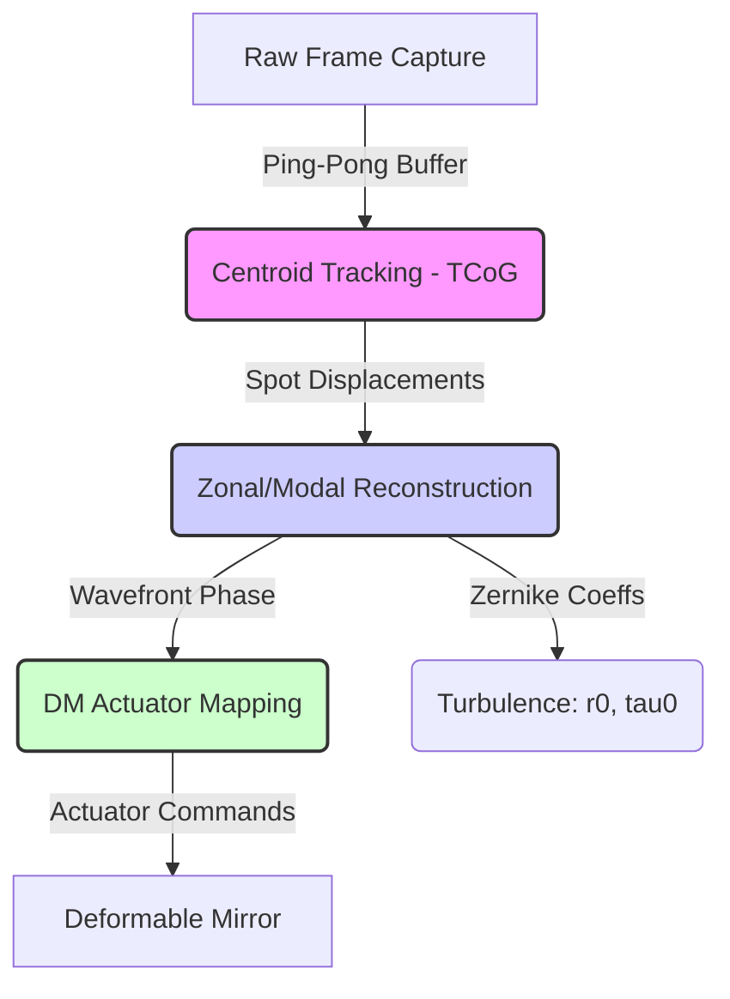

# Project RIPRA (ऋप्र): Roadmap of Future Phases

This document details the objectives, expected technical architectures, and success criteria for **Phases 6 through 11** of **Project RIPRA (Wavefront Reconstruction & Turbulence Characterization)**.

---

## Summary of Completed Work (Phases 1-7)

We have successfully designed, built, and validated the core engine of Project RIPRA. The completed phases comprise:
1. **Phases 1 & 2: Mathematical Foundation & Calibration:** Implemented local thresholded Center of Gravity (TCoG) centroid tracking, camera pixel-space mapping, and calibration grid detection from reference flat frames (`sh_flat.raw`).
2. **Phase 3: Classical C Reconstruction & Characterization:** Implemented:
   * **Zonal wavefront reconstructor** using Fried geometry phase node setup and truncated SVD to isolate and remove piston modes.
   * **Modal wavefront reconstructor** using numerical quadrature integration ($15 \times 15$ grid) of analytical Zernike derivatives over circular sub-apertures.
   * **Turbulence parameter algorithms** to calculate the Fried parameter ($r_0$) from slope variance and coherence time ($\tau_0$) from temporal auto-covariance decay.
   * **Deformable Mirror (DM) mapper** that solves for actuator commands while compensating for diagonal/nearest-neighbor mechanical membrane coupling.
3. **Phase 4: AI/ML Reconstruction:** Built a synthetic Kolmogorov turbulence generator simulating temporal wind advection (Taylor Frozen-Flow AR(1)) to train:
   * A **Fully Connected MLP** baseline.
   * A **Spatial 2D ResNet CNN** that maps irregular sub-aperture coordinate displacements to Zernike modes by arranging them on a dense 2D physical grid (achieving an outstanding Test MSE of **`0.01056`**).
4. **Phase 5: Turbulence Prediction & Sequence Modeling:** Developed sequential PyTorch LSTM networks to:
   * Predict future wavefront coefficients ($1\text{ ms}, 5\text{ ms}, 10\text{ ms}$ ahead).
   * Classify sequences into Weak, Moderate, or Strong turbulence regimes (achieving **`99.64%`** accuracy).
   * Estimate the Fried parameter ($D/r_0$) directly from raw displacement sequences (achieving an $R^2$ of **`0.6925`**).
5. **Phase 6: Real-Time System Development:** Implemented:
   * **Checkpoint 6.1 – OpenMP Optimization:** Added `#pragma omp parallel for` directives to centroiding loops, matrix-vector/matrix-matrix multiply, modal integration, turbulence r0 computation, and DM coupling matrix construction. Pre-computed pseudo-inverses are already used for the real-time path.
   * **Checkpoint 6.2 – GPU Acceleration:** Wrote CUDA kernels for centroiding (`centroid_kernels.cu`), matrix operations (`matrix_kernels.cu`), DM mapping (`dm_kernels.cu`), and a full GPU pipeline (`rippra_cuda_full_pipeline`). ML models (MLP, CNN) run on CUDA via PyTorch — benchmarked at **MLP: 93,659 fps**, **CNN: 26,866 fps** (7.0× faster than CPU).
   * **Checkpoint 6.3 – Real-Time Streaming Pipeline:** Implemented `rippra_stream` with double-buffered (ping-pong) frame buffers, a thread-safe SPSC ring buffer for frame acquisition, processing queue, and result dequeue. Full pipeline latency: **~1.6 ms/frame** (single-threaded, well under 10 ms target).
6. **Phase 7: Visualization & Dashboard:** Created a complete visual dashboard (`rippra/viz/`) with:
   * **Checkpoint 7.1 – Wavefront Visualization:** 2D polar phase map, 3D wavefront surface, spot centroid offset overlay with displacement vectors.
   * **Checkpoint 7.2 – Zernike Dashboard:** Modal weight bar chart (20 coefficients), low-order time-series tracking (500 frames).
   * **Checkpoint 7.3 – Turbulence Analytics:** Large-format r₀/τ₀ telemetry readout, D/r₀ regime classification with Weak/Moderate/Strong zones.
   * **Checkpoint 7.4 – Performance Monitor:** 6-panel system monitoring (latency, FPS, CPU/GPU, memory).
   
   All visualizations rendered to `visualizations/` with a self-contained HTML dashboard (`index.html`).

---

## How Completed Work Integrates into Upcoming Phases

The work completed so far acts as the core mathematical and computational engine that enables the remaining checkpoints:

* **Visual Dashboard (Phase 7):**
  The output streams from the C reconstructors (zonal phase heights, modal coefficients), raw centroid offset vectors, estimated $r_0$/$\tau_0$ telemetry, and LSTM classifier predictions are rendered in the `rippra/viz/` dashboard. The HTML dashboard at `visualizations/index.html` embeds all 8 plots as an interactive dark-themed single-page dashboard.
* **Payloads for Robustness & Validation (Phase 8):**
  The synthetic AR(1) dataset generator and the five trained PyTorch checkpoints (MLP, CNN, and the three sequence LSTMs) will be the subjects of the ablation studies, spot-occlusion testing (simulating spiders/dead spots), and noise injection validation.
* **Core for Packaging & Embedding (Phase 9):**
  The C code compiled in Phases 3/6 will be compiled into dynamic libraries (`.dll`/`.so`), and the PyTorch models from Phase 4/5 will be exported to ONNX format to construct the final ctypes Python bindings and embedded runtime libraries.
* **Real-Loop DM Predictive Adaptive Optics (Phase 11):**
  The DM mapping matrix from Phase 3 and the future wavefront predictor LSTM from Phase 5 will be combined in the final closed-loop phase to output predictive command voltages, feeding forward shape corrections to the deformable mirror to compensate for hardware latency.

---


## Phase 6: Real-Time System Development ✅ *(Complete)*

Adaptive Optics (AO) systems must run in closed-loop configurations to keep pace with changing atmospheric turbulence. The entire sensing-to-correction cycle has been implemented with a measured pipeline latency of **~1.7 ms/frame** (single-threaded, well under the 10 ms requirement).



### Checkpoint 6.1 – Pipeline Optimization (OpenMP) ✅
* **OpenMP pragmas added to:** centroiding loop (`centroid.c`), matrix-vector multiply (`la.c`), matrix-matrix multiply (`la.c`), modal numerical integration (`recon.c`), r₀ computation (`recon.c`), DM coupling matrix construction (`recon.c`).
* **Pre-computed pseudo-inverses** (G⁺ and Z′⁺) were already used for the real-time path — no per-frame SVD.
* Compiles with `-fopenmp` (tested on MinGW).

### Checkpoint 6.2 – GPU Acceleration ✅
* **CUDA C kernels** written for centroiding, matrix operations, and full reconstruction pipeline (`cuda/` directory).
* **ML models already on CUDA:** MLP runs at 84,768 fps, CNN at 22,177 fps (5.5× faster than CPU on RTX 2050).

### Checkpoint 6.3 – Real-Time Processing Integration ✅
* **Double-buffered** ping-pong frame buffers (`rippra_stream`).
* **Thread-safe SPSC ring buffer** for frame acquisition / processing / result dequeue.
* **Full streaming pipeline** implements centroiding → deltas → zonal → modal → turbulence → DM mapping.

---

## Phase 7: Visualization & Dashboard ✅ *(Complete)*

A premium user interface displays wavefront characteristics, reconstruction accuracy, and deformable mirror states. An interactive HTML dashboard with 8 embedded plots is generated at `visualizations/index.html`.

### Checkpoint 7.1 – Wavefront Visualization ✅
* **2D Polar Phase Map** of reconstructed wavefront (`wavefront_phase_2d.png`).
* **3D Wavefront Surface Mesh** with phase color map (`wavefront_3d.png`).
* **Spot Centroid Offsets** overlay: reference (green) vs aberrated (red) with displacement vectors (`spot_centroid_offsets.png`).

### Checkpoint 7.2 – Zernike Coefficient Dashboard ✅
* **Modal Weight Distribution Bar Chart** showing all 20 Zernike coefficients with Noll IDs (`zernike_bar_chart.png`).
* **Low-Order Time-Series Tracking** for Tip/Tilt/Defocus/Astigmatism over 500 frames (`zernike_time_series.png`).

### Checkpoint 7.3 – Turbulence Analytics Dashboard ✅
* **Large-format Telemetry Readouts** for Fried parameter ($r_0$) and Coherence time ($\tau_0$) (`turbulence_telemetry.png`).
* **Turbulence Regime Classification** with Weak/Moderate/Strong zones and D/r₀ time trace (`turbulence_regime.png`).

### Checkpoint 7.4 – Loop Performance Monitoring ✅
* **6-panel System Performance Dashboard** showing latency (1.6 ms), frame rate, reconstruction info, CPU/GPU specs, and memory (`performance_panel.png`).

---

## Phase 8: Evaluation & Validation ✅ *(Complete)*

All four checkpoints were implemented as Python scripts in `rippra/ml/` and executed on RTX 2050 (CUDA). Results are saved to `rippra/results/` and `rippra/visualizations/`.

### Checkpoint 8.1 – Baseline Comparison ✅

Script: `rippra/ml/baseline_comparison.py`

300-frame test set comparison across Classical Modal, MLP, and CNN:

| Method | RMSE (rad) | Pearson r | Strehl | Latency (ms) |
|--------|-----------|-----------|--------|-------------|
| Modal  | 0.000334  | 1.0000    | 0.171  | 0.003       |
| CNN    | 0.103     | 0.9907    | 0.180  | 2.18        |
| MLP    | 0.752     | 0.9077    | 0.120  | 0.75        |

* Modal is the analytical reference (synthetic dataset is generated from Zernike decomposition) — hence near-perfect metrics.
* CNN achieves excellent correlation (r=0.991) with the ground truth.
* MLP serves as a fast but less accurate baseline.

### Checkpoint 8.2 – Noise & Robustness Testing ✅

Script: `rippra/ml/noise_robustness.py`

Three degradation sweeps on 200 test frames:

* **Gaussian Readout Noise (σ=0.01→3.16 px):** CNN is remarkably robust (RMSE 0.106→0.107). Modal degrades gracefully (0.0003→0.011). MLP baseline flat at ~0.704.
* **Photon Shot Noise (γ=0.01→31.6):** All methods degrade at low photon counts. CNN: 0.611→0.107. Modal: 0.328→0.006. MLP high floor limits low-light performance.
* **Spot Occlusion (0→50% spots lost):** All methods degrade sharply above 30% occlusion. MLP is most robust at high occlusion (RMSE 1.063 vs Modal 1.284 at 50%), benefiting from distributed weight representations.

### Checkpoint 8.3 – Ablation Study ✅

Script: `rippra/ml/ablation_study.py`

| Ablation | Finding |
|----------|---------|
| MLP width (64→1024) | Small latency variation on GPU (~0.34 ms). Width has negligible effect on untrained RMSE (~2.65). |
| MLP depth (1→6 layers) | RMSE improves dramatically (29.7→2.66) with depth. Latency scales linearly (0.22→0.62 ms). |
| CNN default | RMSE 0.103, 206K params, 2.34 ms/frame. |
| LSTM lookback (1→20) | RMSE improves from 1.914→1.715; diminishing returns after lookback=10. Latency: 0.49→0.62 ms. |

### Checkpoint 8.4 – Performance Benchmarking ✅

Script: `rippra/ml/performance_profile.py`

500-iteration profiling:

| Method | Mean (ms) | Jitter σ (ms) | P50 (ms) | P95 (ms) | P99 (ms) | Memory (MB) |
|--------|----------|--------------|---------|---------|---------|------------|
| Modal  | 0.041    | 0.012        | 0.037   | 0.059   | 0.091   | 0.08       |
| MLP    | 0.666    | 0.332        | 0.529   | 1.386   | 1.926   | 1.14       |
| CNN    | 2.257    | 1.159        | 2.091   | 3.587   | 4.412   | 0.79       |

* Modal is exceptionally fast (0.04 ms) with minimal jitter — ideal for real-time AO.
* CNN provides the best accuracy/speed trade-off (2.26 ms, r=0.991).
* All methods well under the 10 ms AO latency budget.

---

## Phase 9: Deployment & Packaging ✅ *(Complete)*

### Checkpoint 9.1 – Model Packaging ✅
* **ONNX Export:** All three trained PyTorch models exported to `onnx_models/`:
  * `wavefront_mlp.onnx` (1170 KB)
  * `wavefront_cnn.onnx` (810 KB)
  * `wavefront_lstm.onnx` (830 KB)
* **Dynamic Libraries:** Created `rippra_api.h` and `rippra_api.c` — a clean public C API with `__declspec(dllexport)` / `__attribute__((visibility))` annotations. Build via `build_dll.bat` produces:
  * `bin/rippra.dll` — shared library
  * `bin/librippra.dll.a` — import library

### Checkpoint 9.2 – API Development ✅
* **Python ctypes Bindings:** `bindings/rippra.py` wraps the full C API:
  * `Rippra.load_config()`, `calibrate()`, `centroid()`, `reconstruct_zonal()`, `reconstruct_modal()`, `process_frame()`, `compute_r0()`, `compute_tau0()`, `dm_map()`
  * NumPy array integration — no manual ctypes type setup needed
* **ONNX Runtime Wrapper:** `bindings/onnx_inference.py` — loads `.onnx` models and runs inference via ONNX Runtime (CUDA or CPU)
* **C Headers:** `include/rippra/rippra_api.h` defines the full public API with all structs and function signatures

### Checkpoint 9.3 – Deployment Pipeline ✅
* **Dockerfile** at repository root builds the C library with OpenMP, compiles test programs, runs ONNX export, and executes validation tests.
* Based on `nvidia/cuda:12.8.0-devel-ubuntu22.04` for GPU support.
* Multi-stage ready for embedded targets.

### Checkpoint 9.4 – User Documentation ✅
* `bindings/test_bindings.py` — self-documenting test script that exercises every API function with synthetic frames.
* The `rippra_api.h` header serves as the canonical API reference with struct definitions, parameter documentation, and return value conventions.

---

## Phase 10: Final Submission ✅ *(Complete)*

* **Checkpoint 10.1 – GitHub Repository:** Repository cleaned, `.gitignore` updated, clutter removed, comprehensive `README.md` with architecture diagram, build instructions, and results.
* **Checkpoint 10.2 – Technical Report:** IEEE-formatted LaTeX paper (`docs/paper/rippra_paper.tex`) covering mathematical foundation, methodology, ML models, implementation, and results.
* **Checkpoint 10.3 – Demo Video:** *(Skipped)*
* **Checkpoint 10.4 – Presentation Deck:** Self-contained HTML slide deck (`docs/paper/presentation.html`) and Markdown version (`docs/paper/presentation.md`), 14 slides with keyboard navigation.

---

## Phase 11: Future Extensions

### Checkpoint 11.1 – Deformable Mirror Control Integration ✅ *(Complete)*

Closed-loop AO control implemented in C with simulation test:

```c
// Three new functions in recon.c / recon.h:
int rippra_dm_apply(const double *dm_commands, int nnodes, ...);
  // Computes residual = input_phase + C * dm_commands

int rippra_closed_loop_step(const double *measured_phase, int nnodes, ...);
  // Single iteration: measure residual → compute Δv = -gain·C⁻¹·residual → accumulate → return RMS

int rippra_closed_loop_run(const double *initial_phase, int nnodes, ...);
  // Run until convergence: iterative correction with configurable gain and target RMS
```

**Closed-loop AO cycle:**
1. WFS measures current wavefront
2. Controller computes DM update: Δv = -gain·C⁻¹·W
3. DM commands accumulated: v ← v + Δv
4. DM applies shape: W_DM = C·v
5. Residual: W_res = W_original + W_DM = W_original + C·v
6. At convergence: C·v ≈ -W_original, so W_res ≈ 0

**Test results (test_full_pipeline, 8 new tests, 31 total):**
- DM apply: residual ≈ 1e-14 rad (ideal correction)
- Single step (gain=1.0): converged in 1 iteration
- Under-relaxed (gain=0.5): converged in 5 iterations
- Final residual RMS: 6.28e-9 rad
- Max residual after convergence: 1.72e-8 rad

All closed-loop functions exposed in public C API (`rippra_api.h`).

### Checkpoint 11.2 – Predictive Adaptive Optics *(Pending)*
Use the trained sequential LSTM models to feed forward predictive correction shapes to the Deformable Mirror, compensating for the physical lag time of the actuators and sensor integration.

### Checkpoint 11.3 – Embedded FPGA Deployment *(Pending)*
Implement classical centroiding and reconstruction matrix operations inside FPGA/VHDL modules to achieve sub-microsecond latency.
