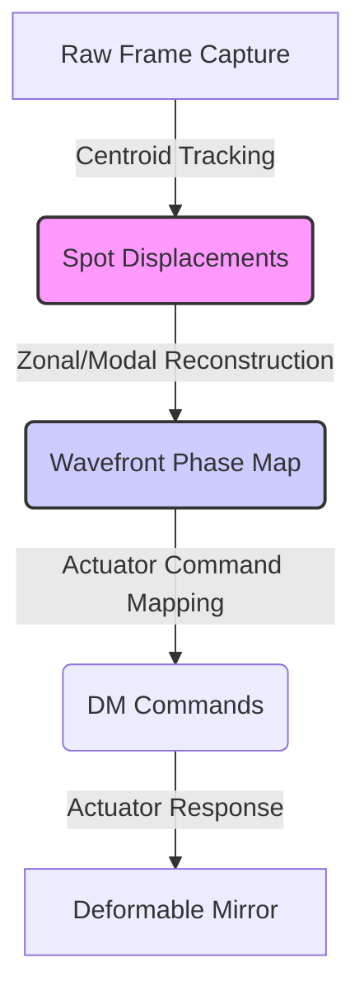

# Project RIPRA (ऋप्र): Roadmap of Future Phases

This document details the objectives, expected technical architectures, and success criteria for **Phases 6 through 11** of **Project RIPRA (Wavefront Reconstruction & Turbulence Characterization)**.

---

## Summary of Completed Work (Phases 1-5)

We have successfully designed, built, and validated the core engine of Project RIPRA. The completed phases comprise:
1. **Phases 1 & 2: Mathematical Foundation & Calibration:** Implemented local thresholded Center of Gravity (TCoG) centroid tracking, camera pixel-space mapping, and calibration grid detection from reference flat frames (`sh_flat.raw`).
2. **Phase 3: Classical C Reconstruction & Characterization:** Implemented:
   * **Zonal wavefront reconstructor** using Fried geometry phase node setup and truncated SVD to isolate and remove piston modes.
   * **Modal wavefront reconstructor** using numerical quadrature integration ($15 \times 15$ grid) of analytical Zernike derivatives over circular sub-apertures.
   * **Turbulence parameter algorithms** to calculate the Fried parameter ($r_0$) from slope variance and coherence time ($\tau_0$) from temporal auto-covariance decay.
   * **Deformable Mirror (DM) mapper** that solves for actuator commands while compensating for diagonal/nearest-neighbor mechanical membrane coupling.
3. **Phase 4: AI/ML Reconstruction:** Built a synthetic Kolmogorov turbulence generator simulating temporal wind advection (Taylor Frozen-Flow AR(1)) to train:
   * A **Fully Connected MLP** baseline.
   * A **Spatial 2D ResNet CNN** that maps irregular sub-aperture coordinate displacements to Zernike modes by arranging them on a dense 2D physical grid (achieving an outstanding Test MSE of **`0.01056`**).
4. **Phase 5: Turbulence Prediction & Sequence Modeling:** Developed sequential PyTorch LSTM networks to:
   * Predict future wavefront coefficients ($1\text{ ms}, 5\text{ ms}, 10\text{ ms}$ ahead).
   * Classify sequences into Weak, Moderate, or Strong turbulence regimes (achieving **`99.64%`** accuracy).
   * Estimate the Fried parameter ($D/r_0$) directly from raw displacement sequences (achieving an $R^2$ of **`0.6925`**).

---

## How Completed Work Integrates into Upcoming Phases

The work completed so far acts as the core mathematical and computational engine that enables the remaining checkpoints:

* **Foundation for Real-Time Execution (Phase 6):**
  The C algorithms and memory layouts established in Phase 3 are the exact targets for multi-threaded parallelization. The pre-computed matrix inverses are designed specifically to minimize loop cycles.
* **Telemetry Source for Dashboards (Phase 7):**
  The output streams from our C reconstructors (zonal phase heights, modal coefficients), raw centroid offset vectors, estimated $r_0$/$\tau_0$ telemetry, and LSTM classifier predictions are the exact datasets that will feed the visual dashboard components.
* **Payloads for Robustness & Validation (Phase 8):**
  The synthetic AR(1) dataset generator and the five trained PyTorch checkpoints (MLP, CNN, and the three sequence LSTMs) will be the subjects of the ablation studies, spot-occlusion testing (simulating spiders/dead spots), and noise injection validation.
* **Core for Packaging & Embedding (Phase 9):**
  The C code compiled in Phase 3 will be compiled into dynamic libraries (`.dll`/`.so`), and the PyTorch models from Phase 4/5 will be exported to ONNX format to construct the final ctypes Python bindings and embedded runtime libraries.
* **Real-Loop DM Predictive Adaptive Optics (Phase 11):**
  The DM mapping matrix from Phase 3 and the future wavefront predictor LSTM from Phase 5 will be combined in the final closed-loop phase to output predictive command voltages, feeding forward shape corrections to the deformable mirror to compensate for hardware latency.

---

## Phase 6: Real-Time System Development

Adaptive Optics (AO) systems must run in closed-loop configurations to keep pace with changing atmospheric turbulence. For high-fidelity astronomical or satellite communications, the entire sensing-to-correction cycle must have latency $< 10\text{ ms}$ (ideally $< 1.0\text{ ms}$).

### Checkpoint 6.1 – Pipeline Optimization (OpenMP)
* **Goal:** Reduce classical CPU C pipeline latency to $< 1.0\text{ ms}$ per frame.
* **Approach:**
  * **Multithreading:** Inject OpenMP directives (`#pragma omp parallel for`) into high-overhead loops:
    * Spot centroid tracking: Calculate the local Center of Gravity (CoG) for all 127 spots in parallel.
    * Matrix multiplication: Parallelize row multiplications in `rippa_matvec` for geometry and Zernike derivative matrix projections.
    * Modal numerical integration: Multi-thread the circular disk area integration during system startup.
  * **Algorithmic Pruning:** Pre-compute the SVD pseudo-inverses ($\mathbf{G}^+$ and $\mathbf{Z}'^+$) during calibration so that the real-time path only executes fast matrix-vector products.

### Checkpoint 6.2 – GPU Acceleration
* **Goal:** Accelerate both classical centroiding and AI/ML model inference on GPUs.
* **Approach:**
  * **AI/ML GPU Pipeline:** Run the `WavefrontCNN` and sequence LSTMs directly on CUDA execution devices (`device = 'cuda'`).
  * **Classical GPU Paths:** Explore CUDA/OpenCL parallelization for full-frame raw image processing (e.g. thresholding, filtering, and centroid extraction).

### Checkpoint 6.3 – Real-Time Processing Integration
* **Goal:** Create a simulated low-latency streaming pipeline to process time-series frames continuously.
* **Approach:**
  * Implement double-buffering (ping-pong buffers) where one buffer stores incoming camera frames while the other is being processed.
  * Establish a circular queue to handle multi-threaded frame acquisition and processing pipelines.

---

## Phase 7: Visualization & Dashboard

A premium user interface is essential to display the wavefront characteristics, reconstruction accuracy, and deformable mirror states in real-time.

### Checkpoint 7.1 – Wavefront Visualization
* **2D Phase Maps:** Render a 2D color contour plot of the reconstructed phase profile $\phi(x, y)$ over the pupil aperture.
* **3D Wavefront Profiles:** Render interactive 3D surface meshes (using Plotly, Three.js, or Matplotlib) showing the physical shape of the wavefront deviations in microns.
* **Spot Centroid Offsets:** Render the camera frame grid overlaid with reference centroids (green circles) and aberrated centroids (red crosses), with vectors indicating displacement magnitudes.

### Checkpoint 7.2 – Zernike Coefficient Dashboard
* **Modal Weight Distribution:** Render dynamic bar charts displaying the Zernike coefficients $a_2 \dots a_{21}$.
* **Time-Series Tracking:** Provide a scrolling line graph to track the evolution of low-order modes (e.g., Tilt, Defocus, Astigmatism) over time.

### Checkpoint 7.3 – Turbulence Analytics Dashboard
* **Turbulence Parameters:** Display large, premium telemetry readouts for the Fried parameter ($r_0$), Coherence time ($\tau_0$), and estimated wind speed vectors.
* **regime Telemetry:** Display the active classification status of the turbulence (Weak, Moderate, Strong) based on sequential LSTM outputs.

### Checkpoint 7.4 – Loop Performance Monitoring
* **Loop Status:** Indicate closed-loop vs. open-loop states, frame rates (FPS), memory footprint, and CPU/GPU utilization percentages.

---

## Phase 8: Evaluation & Validation

A thorough verification of model performance, limits of correctness, and ablation parameters ensures the system's operational readiness.

### Checkpoint 8.1 – Baseline Comparison
* Create a master benchmark script comparing all implemented algorithms under identical noise conditions:
  $$\text{Classical Zonal vs. Classical Modal vs. WavefrontMLP vs. WavefrontCNN}$$
* Metrics: Reconstruction RMSE, Pearson correlation coefficients, and peak-to-valley wavefront values.

### Checkpoint 8.2 – Noise & Robustness Testing
* Evaluate reconstruction accuracy under varying photon levels (Poisson noise) and thermal readout noise (Gaussian noise).
* **Spot Occlusion / Dropout Test:** Evaluate reconstruction performance when a subset of sub-aperture centroids is blocked (simulating pupil obscuration, spiders, or dead spots in the detector).

### Checkpoint 8.3 – Ablation Study
* Systematically evaluate network design choices:
  * Impact of LSTM lookback window lengths ($L = 5, 10, 20$).
  * Impact of CNN grid resolutions ($13 \times 13$ vs $15 \times 15$).
  * Impact of model architectures (MLP, ResNet, sequential Transformers).

### Checkpoint 8.4 – Performance Benchmarking
* Profile process execution memory footprints, startup compilation latency, per-frame execution averages, and latency jitter profiles (variance in execution times).

---

## Phase 9: Deployment & Packaging

To make the codebase accessible to actual AO systems, it must be compiled, containerized, and packaged with clean programming APIs.

### Checkpoint 9.1 – Model Packaging
* **ONNX Export:** Export trained PyTorch models (CNN, LSTMs) to Open Neural Network Exchange (ONNX) format for fast, hardware-independent runtime execution.
* **Dynamic Libraries:** Package the C modules into dynamic libraries (`librippra.so` on Linux, `rippra.dll` on Windows) for easy embedding.

### Checkpoint 9.2 – API Development
* **Python Bindings:** Create standard bindings using `ctypes` or `CFFI` so that Python scripts can execute the high-performance classical C reconstructor directly.
* **C APIs:** Define clear header interfaces for integrating model runtimes (via ONNX Runtime C API or LibTorch) directly into C++ control loops.

### Checkpoint 9.3 – Deployment Pipeline
* Set up automated compilation scripts (CMake/Make) and container structures (Docker) to compile and run the codebase on target embedded systems (e.g., NVIDIA Jetson, Raspberry Pi, or industrial PCs).

### Checkpoint 9.4 – User Documentation
* Write comprehensive manuals detailing system configuration (`system.conf`), API function signatures, calibration procedures, and ML training instructions.

---

## Phase 10: Final Submission

The culmination of the project involves compiling, formatting, and presenting all research findings, code structures, and demonstrations.

* **Checkpoint 10.1 – GitHub Repository:** Fully clean, refactor, and format all source directories, ensuring comments conform to coding standards and a comprehensive `README.md` is provided at the root.
* **Checkpoint 10.2 – Technical Report:** Author a LaTeX technical report/academic paper detailing the mathematical foundations, implementations, machine learning models, and comparative evaluation results.
* **Checkpoint 10.3 – Demo Video:** Record a high-quality video showing the real-time C reconstruction benchmark running, the ML models training, and the visualization dashboards rendering live wavefront maps.
* **Checkpoint 10.4 – Presentation Deck:** Compile a slideshow covering problem analysis, mathematical frameworks, C achievements, deep learning results, real-time latencies, and future outlooks.

---

## Phase 11: Future Extensions

For advanced systems, these research-grade features pave the way toward space-grade operational deployment:

* **Checkpoint 11.1 – Deformable Mirror Control Integration:** Complete closed-loop integration with hardware DM drivers, mapping wavefront reconstruction phase heights directly to actual actuator driver commands.
* **Checkpoint 11.2 – Predictive Adaptive Optics:** Use the trained sequential LSTM models to feed forward predictive correction shapes to the Deformable Mirror, compensating for the physical lag time of the actuators and sensor integration.
* **Checkpoint 11.3 – Embedded FPGA Deployment:** Implement classical centroiding and reconstruction matrix operations inside FPGA/VHDL modules to achieve sub-microsecond latency.
